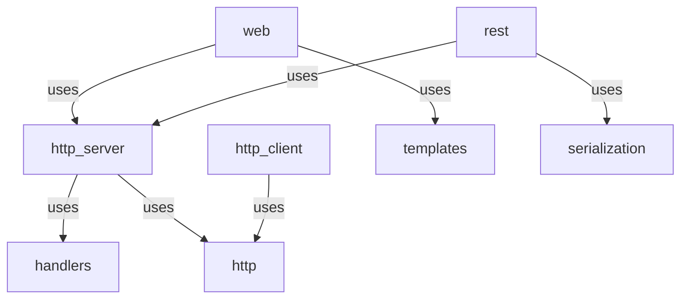

## About Me
* Java back-end developer since 2000
  <!-- .element: class="fragment" data-fragment-index="1" -->
* Open Source enthusiast
  <!-- .element: class="fragment" data-fragment-index="2" -->
* Kotlin developer since the logo was a teapot
  <!-- .element: class="fragment" data-fragment-index="3" -->

---

## Agenda
1. Presentation
2. Hexagonal application walk through & demo
3. Refactor to demonstrate Hexagon routing

---

## Hexagon Introduction
* Toolkit (not framework) for back-end applications
  <!-- .element: class="fragment" data-fragment-index="1" -->
* Modular features (pick only what you need)
  <!-- .element: class="fragment" data-fragment-index="2" -->
* Pluggable adapters (switch implementations easily)
  <!-- .element: class="fragment" data-fragment-index="3" -->
* Motivation
  <!-- .element: class="fragment" data-fragment-index="4" -->
  * Don't abuse third party libraries
    <!-- .element: class="fragment" data-fragment-index="5" -->
  * Avoid bloated applications
    <!-- .element: class="fragment" data-fragment-index="6" -->

---

## Design goals
1. Thin layer, easy to be understood and maintained
   <!-- .element: class="fragment" data-fragment-index="1" -->
2. Allow easily testable applications
   <!-- .element: class="fragment" data-fragment-index="2" -->
3. Avoid reflection, classpath scanning, and code generation
   <!-- .element: class="fragment" data-fragment-index="3" -->
4. Flat dependencies (ports must not depend on other ports)
   <!-- .element: class="fragment" data-fragment-index="4" -->

---

## Hello World
* Check the <a href="https://hexagonkt.com/quick_start" target="_blank">
  Quick start</a> page
* Clone a 'starter' repository
* These slides are served used Hexagon

---

## Hexagonal/Clean Architecture
* Isolate business logic from context (infrastructure)
  * Improves application testability
    <!-- .element: class="fragment" data-fragment-index="2" -->
  * Allow easy replacement of application parts
    <!-- .element: class="fragment" data-fragment-index="3" -->
* Ports: input (driver), output (driven)
  <!-- .element: class="fragment" data-fragment-index="4" -->
* Application logic: use cases, services or domain
  <!-- .element: class="fragment" data-fragment-index="5" -->

<!-- .element: class="r-stretch" -->

---

## Hexagon Architecture
* It cannot enforce Hexagonal Architecture on clients
  <!-- .element: class="fragment" data-fragment-index="1" -->
* Is meant to be used in the Application Layer
  <!-- .element: class="fragment" data-fragment-index="2" -->
* Uses the Ports/Adapters scheme, the domain is the client application
  <!-- .element: class="fragment" data-fragment-index="3" -->

<!-- .element: class="r-stretch" -->

---

## Module Dependencies
* Two types of ports:
  <!-- .element: class="fragment" data-fragment-index="1" -->
  * Standard: holds features, provide interfaces
    <!-- .element: class="fragment" data-fragment-index="2" -->
  * Composed: provide helpers combining different ports
    <!-- .element: class="fragment" data-fragment-index="3" -->

graph TD
  http_server -->|uses| handlers
  http_server -->|uses| http
  http_client -->|uses| http
  web -->|uses| http_server
  web -->|uses| templates
  rest -->|uses| http_server
  rest -->|uses| serialization

---

<!-- .slide: data-visibility="hidden" -->

---

## Hexagon Benefits
* Make applications small (few third party libraries)
  <!-- .element: class="fragment" data-fragment-index="1" -->
* Small enough to understand its internals fast
  <!-- .element: class="fragment" data-fragment-index="2" -->
* Make application testing easier
  <!-- .element: class="fragment" data-fragment-index="3" -->

---

## Example Application
* API to manage appointments
  * Create appointment: store data and send notification
  * Get appointment: fetch data
  * Delete appointment: remove data and send notification

---

## Stay in Touch
* v3.0 and beyond: native image, async, coroutines
* The tool is used on internal and personal projects (like [codecv])
* Follow the [@hexagon_kt] Twitter account to be notified on Hexagon and related tools
* If you like the project, please share... And give it a ⭐

[codecv]: https://github.com/hexagonkt/codecv
[@hexagon_kt]: https://twitter.com/hexagon_kt
